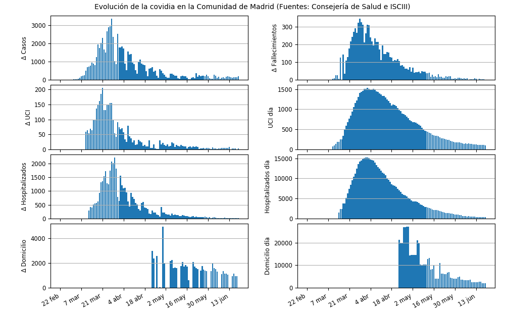
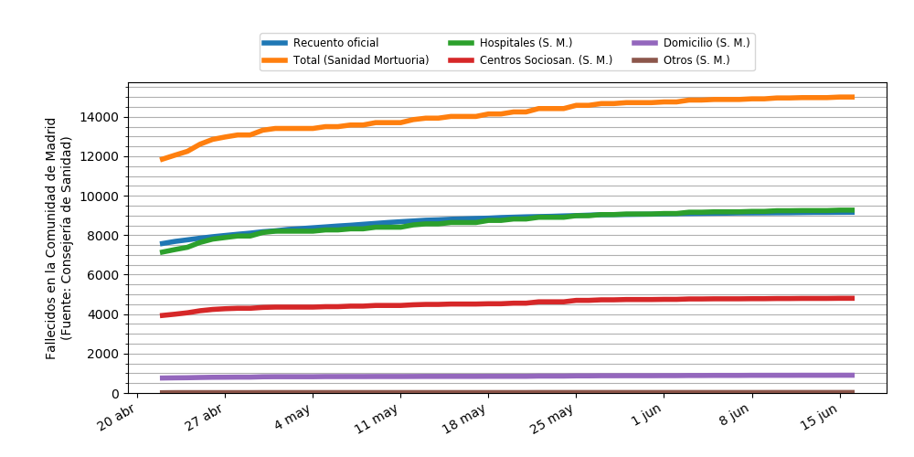

El *script* de Python `descarga_cam.py` es para **descargar** los informes diarios pdf de la Consejería de Salud de la Comunidad de Madrid datos sobre covidia de la Consejería de Salud de la Comunidad de Madrid y **procesarlos** para crear el fichero `madrid-series.csv`. `descarga_cam.py` necesita el módulo de Python `descargabib.py` que también está disponible en este directorio.

Requiere las bibliotecas Python: requests, pdfminer y pandas

En la columna de `hospitalizados_dia` sumo los Hospitalizados ingresados en el día y los de la UCI ingresados en el día, tal como hacía el Ministerio de Sanidad en sus informes: entiendo que los Hospitalizados ingresados en el día de la Consejería de Salud no incluyen a los de la UCI, mientras el Ministerio de Sanidad sí los incluye.

Los informes PDF de la Consejería de Salud de la Comunidad de Madrid están disponibles en:

https://www.comunidad.madrid/servicios/salud/2019-nuevo-coronavirus#situacion-epidemiologica-actual

El fichero `madrid-historico.csv` contiene las series con datos que complementan o incluso sustituyen los datos que proporciona la Consejería de Salud en `madrid-series.csv`.

Así las columnas de `Recuperados`, `uci_dia` y `hospitalizados_dia` del fichero `madrid-historico.csv` fueron proporcionados por el Instituto de Salud Carlos III (ISCIII) en las series publicadas el 26 de abril de 2020.

Las columnas `CASOS_PCR`, `Hospitalizados`, `UCI` y `Fallecidos` del fichero `madrid-historico.csv` corresponden a las series actualizas por el Instituto de Salud Carlos III (ISCIII) en las series publicadas el 21 de mayo de 2020.

Los datos del fichero `madrid-historico.csv` tienen preferencia a los de `madrid-series.csv`.

